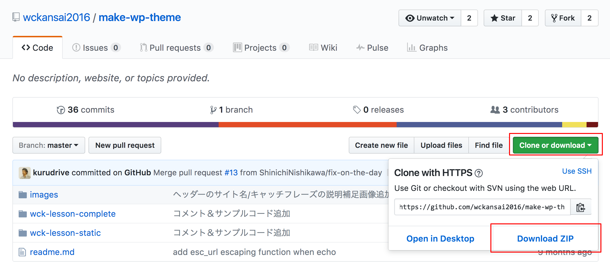
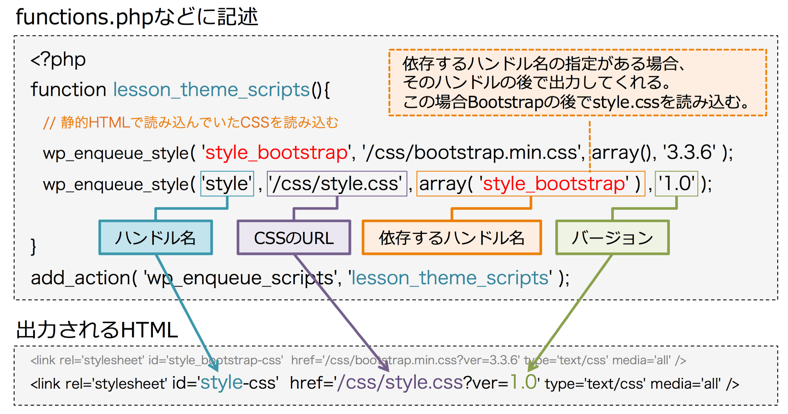
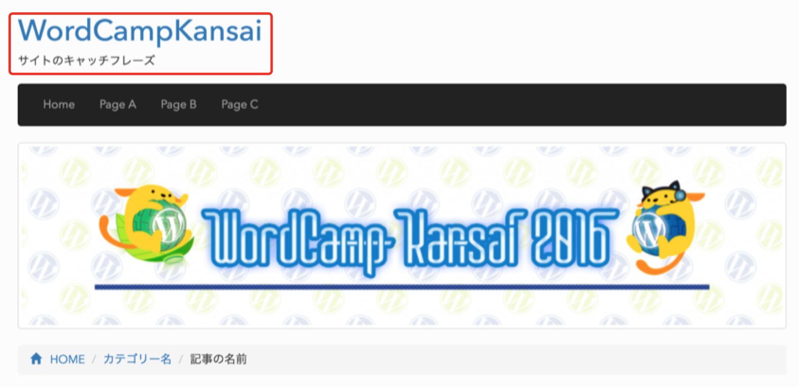

# WordPress テーマ制作 ハンズオン

## 世話役
[石川 栄和](https://profiles.wordpress.org/kurudrive/)　/　[西川 伸一](https://profiles.wordpress.org/shinichin/)　/　[鳥山 優子](https://profiles.wordpress.org/sysbird/)　/　[キタジマタカシ](https://profiles.wordpress.org/inc2734/)　/　[Mignon Style](https://profiles.wordpress.org/mignonstyle/)

## はじめに

この手順・サンプルソースはWordPressのテーマを作った事がないノンプログラマーの人を対象に、  
WordPressのテーマ制作で最低限抑えておきたいポイントを短時間で実践する事を前提とした内容となっています。

## ディレクトリの準備

1. 下記のURLからハンズオン用のデータをダウンロードしてください。 https://github.com/wckansai2016/make-wp-theme  

1. wck-lesson-static フォルダの index.htmlを見てみましょう。今日はこのページをWordPressのテーマに変更していきます。
1. wck-lesson-static フォルダを複製してフォルダ名を wck-lesson に変更
1. wck-lessonディレクトリを /wp-content/themes/ ディレクトリにアップ

## テーマを適用させる

WordPressのテーマには最低 style.css と index.php の２つのファイルが必要です。
まずはその２つのファイルを用意しましょう。

### style.cssを作る

WordPressではテーマの名前や説明などの基本情報をstyle.cssに記述します。
style.cssファイルを新規作成し、下記の記述例を貼り付けて、テーマの名前などを変更してみましょう。

テーマの style.css に最低限必要な記述例
~~~
@charset "utf-8";
/*
Theme Name: テーマの名前
Description: テーマの説明
Author: 作成者の名前
Author URI: http://www.xxxxx.xxx
Version:0.0.0
License: GNU General Public License v2 or later
License URI: http://www.gnu.org/licenses/gpl-2.0.html
*/
~~~

### index.php を作る

とりあえず index.html のファイル名（拡張子）を index.php に変更して下さい。

### 確認してみよう

これで style.css と index.php は存在しますので、WordPressのテーマとして有効化する事ができます。
管理画面の「外観」→「テーマ」を確認してみましょう。
style.cssに記述した内容のテーマがあるはずです。
これを有効化してみましょう。

WordPressのテーマとしては適用されますが、CSSや画像がリンク切れになっているはずです。

今までindex.htmlのあったファイルを基準に相対パスで参照していたのに対して、
WordPressで設定されている公開URLでページを表示するようになったので、
公開URLからの相対パスの位置にはCSSファイルや画像ファイルがないからです。

## トップビジュアル画像のリンク切れの修正

まずはトップの画像がリンク切れになっているのを修正します。  
トップビジュアルは現状  

~~~

~~~

と書かれていますが、WordPressのテーマがあるディレクトリまでのURLは <?php echo get_template_directory_uri(); ?> で出力する事ができますので、下記のように書き換えます。

~~~
/images/top_visual.png" alt="" />
~~~

これで画像が正しく表示されるようになる事が確認できます。

## css と js の再設定

画像と同様に、cssファイルやjsファイルの参照先が静的htmlファイルの時とは異なるので、cssやjavascriptが適用されていない状態になっていますので修正します。

### wp_head() と wp_footer() の設定

index.php の headタグの閉じタグの直前に wp_head(); 関数を記述します。

~~~
<?php wp_head();?>
</head>
<body>
~~~

同様に index.php の body の閉じタグの直前に wp_footer(); 関数を記述します。

~~~
<?php wp_footer();?>
</body>
</html>
~~~

#### 補足 : wp_head() と wp_footer()

WordPressでは例えば画像をポップアップ表示するプラグインとして有名なLightbox系のプラグインをインストールして有効化すると、テーマファイルに変更を加えていないのに、公開されているサイトのHTMLを見てみるとLightboxのjavascriptやcssが読み込まれていて正常に動作するようになります。  
これはLightboxのjsファイルやcssファイルが wp_head() や wp_footer() 関数を経由して出力されているからです。  
よって、この関数が適正な位置に記載されていないとWordPressのテーマとして正しく動作しません。

### cssの出力

現在、javascriptやcssファイルの読み込みが index.php に直接記載されていますが、WordPressでは先ほど記載した wp_head() や wp_footer() を経由して出力します。

まず wck-lesson ディレクトリの中に functions.php というファイル名でファイルを作成します。

~~~
<?php 
function lesson_theme_scripts(){

  // 静的HTMLで読み込んでいたCSSを読み込む
  wp_enqueue_style( 'lesson_css_bootstrap', get_template_directory_uri() . '/css/bootstrap.min.css', array(), '3.3.6' );
  wp_enqueue_style( 'lesson_css', get_template_directory_uri() . '/css/lesson_style.css', array('lesson_css_bootstrap'), '1.0' );

  // テーマディレクトリ直下にある style.css を出力
  wp_enqueue_style( 'lesson_theme_style', get_stylesheet_uri(), array( 'lesson_css' ),'20160710' );

}
add_action( 'wp_enqueue_scripts', 'lesson_theme_scripts' );
~~~

これでサイトを見てみましょう。CSSが適用されているのが確認出来るはずです。

CSSを読み込むためにindex.phpの head 内に直接記載してあった下記のコードは不要なので削除しておきましょう。
~~~
<!-- [ Load CSS ] -->
<link href="css/bootstrap.min.css" rel="stylesheet">
<link href="css/lesson_style.css" rel="stylesheet">
<!-- [ /Load CSS ] -->
~~~

#### なぜ head に直書きでなく wp_enqueue_style() を使うのか？

テーマディレクトリまでの階層は <code><?php echo get_template_directory_uri();?></code>で取得できるので head 内に下記のような記述をしがちです。

##### 非推奨の記述例
~~~
<link rel='stylesheet' href='<?php echo get_template_directory_uri();?>/css/style.css' type='text/css' media='all' />
~~~

この記述だと正しい階層を辿ってCSSファイルを読み込む事は出来ますが、WordPressでは wp_enqueue_style() 関数を使って読み込む事が推奨されています。

##### wp_enqueue_style を理解する

##### 1.正しい順番で読み込む

いろいろなjsやcssファイルを読み込む時、正しい順番で読み込まないと正常に動作しない事があります。  
例えばjQueryのプログラムがその代表で、元となるjQueryのファイルの後で読み込まなくては正しく動作しません。  
今回のCSSファイルについてはCSSフレームワークのBootstrapのCSSを読み込んだ後で、固有のCSSを読み込む必要があります。
そこで、読み込むファイルが別のどのファイルに依存しているかを指定する事によって、WordPressが適切な順番で出力してくれます。  

<?php wp_enqueue_style( ハンドル名, 参照先, 依存するハンドル名, バージョン, メディア ); ?>

##### 2.（補足）プラグインなど外部から操作出来るようになる

テーマで読み込まれているjsファイルやcssファイルを外部のプラグインなどから解除したい時に wp_deregister_script() や wp_deregister_style() を使えば、テーマを改変する事なく読み込みを解除する事ができるようになります。

~~~
// スタイルシートの読み込みを解除するサンプル
add_action( 'wp_print_styles', 'lesson_deregister_styles', 100 );
function lesson_deregister_styles() {
    wp_deregister_style('lesson_css');
}
~~~

参考 : [関数リファレンス/wp enqueue style](https://wpdocs.osdn.jp/%E9%96%A2%E6%95%B0%E3%83%AA%E3%83%95%E3%82%A1%E3%83%AC%E3%83%B3%E3%82%B9/wp_enqueue_style)

### javascriptファイルの出力

CSSが正しく適用されたら次はjavascriptファイルを読み込みます。  

画面サイズを小さくすると、メニューがたたまれてハンバーガーメニューになりますが、javascriptが正しく読み込まれてないので、ハンバーガーメニューをクリックしてもメニューが展開されないので、これを修正します。

先ほどの lesson_theme_scripts() 関数の中に下記を追記します。

~~~
// テーマ用のjsを読み込む
wp_enqueue_script( 'lesson-js-bootstrap', get_template_directory_uri() . '/js/bootstrap.min.js', array( 'jquery' ), '20160710', true );
~~~

全体では下記にようになります。

~~~
<?php 
function lesson_theme_scripts(){

  // 静的HTMLで読み込んでいたCSSを読み込む
  wp_enqueue_style( 'lesson_css_bootstrap', get_template_directory_uri() . '/css/bootstrap.min.css', array(), '3.3.6' );
  wp_enqueue_style( 'lesson_css', get_template_directory_uri() . '/css/lesson_style.css', array('lesson_css_bootstrap'), '1.0' );

  // テーマディレクトリ直下にある style.css を出力
  wp_enqueue_style( 'lesson_theme_style', get_stylesheet_uri(), array( 'lesson_css' ),'20160710' );

  // テーマ用のjsを読み込む
  wp_enqueue_script( 'lesson-js-bootstrap', get_template_directory_uri() . '/js/bootstrap.min.js', array( 'jquery' ), '20160710', true );

}
add_action( 'wp_enqueue_scripts', 'lesson_theme_scripts' );
~~~

これで wp_footer()経由でjsファイルが出力されるので、bodyの閉じタグの直前に記載してある下記のコードは削除します。

~~~
<!-- [ Load JS ] -->

<!-- [ / Load JS ] -->
~~~

これでjavascriptも正しく動作しているのが確認出来るはずです。

## タイトルタグの設定

続いてSEOでも重要になる head の title タグを設定します。

これも wp_head() から出力してしまうので、
index.php に記載されている下記の title タグは必要ありませんので削除します。

~~~
<title>WordCamp Kansai 2016</title>
~~~

それから wp_head() から出力するための記述を functions.php に追加します。

~~~
function lesson_theme_title() {
    add_theme_support( 'title-tag' );
}
add_action( 'after_setup_theme', 'lesson_theme_title' );
~~~

これで自動的に head 内に wp_head() を経由して title タグが出力されます。 

#### 補足 : title で出力される中身を任意に改変したい

titleタグに出力される文言は非常に重要なので、自分の思うように変更したい人は多いと思いますが、プラグインを使えば簡単に設定できます。

* [Yoast SEO](https://ja.wordpress.org/plugins/wordpress-seo/)
* [All in One SEO Pack](https://ja.wordpress.org/plugins/all-in-one-seo-pack/)

使い方は「 [Yoast SEO 使い方](https://www.google.co.jp/search?q=Yoast+SEO+%E4%BD%BF%E3%81%84%E6%96%B9&oq=Yoast+SEO+%E4%BD%BF%E3%81%84%E6%96%B9&aqs=chrome..69i57.362j0j7&sourceid=chrome&ie=UTF-8) 」などで検索してみてください。

## ヘッダーのタイトル／リンク／キャッチフレーズを設定

■サイト名を表示  
<?php bloginfo( 'name' ); ?>

■サイトURLを表示  
<?php echo esc_url( home_url( '/' ) ); ?>

■ヘッダー上部にディスクリプションを設定  
<?php bloginfo( 'description' ); ?>

下記のように変更してください。

~~~
<h1 class="wck_head_logo"><a href="<?php echo esc_url( home_url( '/' ) ); ?>"><?php bloginfo( 'name' ); ?></a></h1>
<h2 class="wck_head_description"><?php bloginfo( 'description' ); ?></h2>
~~~

## 投稿のループの作成

ブログではトップページやカテゴリーページに、記事が新しい順で数件表示されているのが一般的です。
ここではWordPressに登録されている投稿を呼び出す記述をします。

index.php のコメントの『記事のループ』の直後に下記を貼り付けます。

~~~
<!-- [ 記事のループ ] -->
<?php if ( have_posts() ) { ?>
<?php while( have_posts() ) : the_post(); ?>
<article>★ 投稿の内容が繰り返されます ★</article>
<?php endwhile; ?>
<?php } ?>
~~~

これで確認すると、WordPressに登録されている投稿の数だけ  
『★ 投稿の内容が繰り返されます ★』  
が表示されるはずです。

### ループ内に１件分の article のHTMLを差し替え

続いて、

~~~
<article>★ 投稿の内容が繰り返されます ★</article>
~~~
の部分を、その後ろの article の1件分の内容に差し替え、それ以外の article の部分は削除します。

### 投稿の情報を反映させる

article の中の投稿のタイトル名などを下記を参考に書き換えてください。

■ 投稿のタイトル名  
<?php the_title(); ?>

■ 記事詳細ページへのリンク  
<?php the_permalink(); ?>

■ 記事の投稿日  
<?php the_date(); ?>

■ 記事の投稿者  
<?php the_author(); ?>

■ 記事のカテゴリー名とリンク  
<?php the_category(','); ?>

■ 記事の本文  
<?php the_content(); ?>

上記書き換えると１件分は下記のようなコードになります
~~~
<article class="wck_section">
  <header class="page-header">
    <h1><a href="<?php the_permalink(); ?>"><?php the_title(); ?></a></h1>
    

     <?php the_date(); ?>　 
     <?php the_author(); ?>　 
     <?php the_category(','); ?>
    

  </header>
  

  <!-- [ 記事の本文 ] -->
  <?php the_content(); ?>
  <!-- [ /記事の本文 ] -->
  

</article>
~~~

これでWordPressの管理画面で投稿されている内容が反映されるのが確認できます。

## ページングの設定

投稿のループの終わりである <?php endwhile; ?> の後に  

~~~
<?php the_posts_pagination(); ?>
~~~

を記述すると、ページ送りが表示されます。

## サイドバーの設定（カテゴリーリスト/アーカイブリスト）

サイドバーはコメントで [ #sub ] と書いてある部分に記述してあります。

### カテゴリーリスト

サイドバーに表示されているカテゴリーリストは

~~~
<h4 class="wck_sub_section_title">カテゴリー</h4>
<ul>
<li><a href="#">カテゴリー1</a></li>
<li><a href="#">カテゴリー2</a></li>
<li><a href="#">カテゴリー3</a></li>
</ul>
~~~

と記載されていますが、  
<?php wp_list_categories(); ?>  
関数を使うと、カテゴリーの一覧とリンクを取得できるので下記のように書き換えます。

~~~
<h4 class="wck_sub_section_title">カテゴリー</h4>
<ul>
<?php wp_list_categories('title_li='); ?>
</ul>
~~~

### 月別アーカイブリスト

カテゴリー同様に

~~~ 
<h4 class="wck_sub_section_title">月別</h4>
<ul>
<li><a href="#">2016年7月</a></li>
<li><a href="#">2016年6月</a></li>
<li><a href="#">2016年5月</a></li>
</ul>
~~~

と記載されている箇所を

~~~
<h4 class="wck_sub_section_title">月別</h4>
<ul>
<?php wp_get_archives('type=monthly'); ?>
</ul>
~~~

に書き換えます。これで月別アーカイブへのリストが出力されます。

### ウィジェットエリアの作成

カテゴリーやアーカイブリストはウィジェットエリアを設定して、ウィジェットで表示する事も可能です。

#### ウィジェットエリアの設定

まずは管理画面でウィジェットを登録出来るようにfunctions.phpに以下のコードを貼り付けます。

~~~
function lesson_widgets_init() {
  register_sidebar( array(
    'name' => 'Sidebar',
    'id' => 'sidebar-widget-area',
    'before_widget' => '<aside class="wck_sub_section wck_section %2$s" id="%1$s">',
    'after_widget' => '</aside>',
    'before_title' => '<h4 class="wck_sub_section_title">',
    'after_title' => '</h4>',
  ) );
}
add_action( 'widgets_init', 'lesson_widgets_init' );
~~~

上記コードの各パラメーターの意味は下記の通りです。

<table>
<tr><th>name</th><td>管理画面に表示されるウィジェットエリア名</td></tr>
<tr><th>id</th><td>ウィジェットのid</td></tr>
<tr><th>before_widget</th><td>ウィジェットの最初に出力されるHTML</td></tr>
<tr><th>after_widget</th><td>ウィジェットの最後に出力されるHTML</td></tr>
<tr><th>before_title</th><td>ウィジェットのタイトルの前に出力されるHTML</td></tr>
<tr><th>after_title</th><td>ウィジェットのタイトルの後に出力されるHTML</td></tr> 
</table>

参考 :  [Codex(関数リファレンス/register sidebar)](https://wpdocs.osdn.jp/%E9%96%A2%E6%95%B0%E3%83%AA%E3%83%95%E3%82%A1%E3%83%AC%E3%83%B3%E3%82%B9/register_sidebar)

これで「管理画面」→「外観」→「ウィジェット」を確認すると「Sidebar」というウィジェットエリアができている事が確認できます。  

続いて、ウィジェットエリアにセットしたウィジェットが公開画面側で表示されるようにしましょう

#### ウィジェットを表示する設定

サイドバーの一番上に表示してみましょう。

~~~
<!-- [ #sub ] -->

~~~

と記述されている部分を下記に貼り替えます。

~~~
<!-- [ #sub ] -->

<?php 
// ウィジェットエリアid 'sidebar-widget-area' にウィジェットアイテムが何かセットされていた時
if ( is_active_sidebar( 'sidebar-widget-area' ) ) 
  // sidebar-widget-area に入っているウィジェットアイテムを表示する
  dynamic_sidebar( 'sidebar-widget-area' );
?>
~~~

これで「管理画面」→「外観」→「ウィジェット」やカスタマイザーからウィジェットをセットしてみてください。セットしたウィジェットが表示されるのが確認出来ると思います。

## グローバルメニューにカスタムメニューを設定する

まず、カスタムメニューが利用出来るように functions.php に下記を貼り付けます。

~~~
function lesson_theme_custom_menu() {
    register_nav_menus( array( 'Header Navigation' => 'Header Navigation', ) );
}
add_action( 'after_setup_theme', 'lesson_theme_custom_menu' );
~~~

これで管理画面の「外観」→「メニュー」から Header Navigation というメニューエリアにメニューを設定する事が出来るようになります。

しかし、これだけでは公開されているサイトには反映されません。

ヘッダーのメニューに該当する下記の部分を...

~~~
<ul class="nav navbar-nav">
  <li><a href="#">Home</a></li>
  <li><a href="#">Page A</a></li>
  <li><a href="#">Page B</a></li>
  <li><a href="#">Page C</a></li>
</ul>
~~~

カスタムメニューを表示する wp_nav_menu() 関数を使って下記のように呼び出します。

~~~
<?php
$args = array(
    'theme_location' => 'Header Navigation',
    'items_wrap'     => '<ul id="%1$s" class="%2$s nav navbar-nav wck_nav">%3$s</ul>',
);
wp_nav_menu( $args ) ;
?>
~~~

これでカスタムメニューが反映されます。

- - -

# 時間があれば

## パンくずリストの作成（条件分岐）

トップの画像の下にあるパンくずリストについて、ページによって表示内容が変わるように設定していきましょう。

まずは HOME のリンク先を <?php echo esc_url( home_url( '/' ) ); ?> に変更します

### 詳細ページでのみ表示する条件分岐

次に HOME の次のカテゴリー名と投稿のタイトルは、投稿の詳細ページでしか必要ないので、

~~~
<?php if ( is_single() ) { ?>
<li><a href="#">カテゴリー名</a></li>
<li>投稿のタイトル</li>
<?php } ?>
~~~

とします。

if ( is_single() ) で投稿の詳細ページの場合のみ実行するという条件分岐ができます。

トップページのパンくずでは HOME だけが表示されて、記事のタイトルをクリックして投稿の詳細ページに移動すると、カテゴリー名と投稿タイトルまで表示されている事が確認できます。

『カテゴリー名』の部分は a タグも含めて <?php the_category(','); ?> タグに置き換え、
『投稿タイトル』の部分を <?php the_title();?> に書き換えます。

~~~
<ol class="breadcrumb">
  <li><a href="<?php echo esc_url( home_url( '/' ) ); ?>">HOME</a></li>
  <?php if ( is_single() ) { ?>
  <li><?php the_category(','); ?></li>
  <li><?php the_title();?></li>
  <?php } ?>
</ol>
~~~

これで投稿の詳細ページでカテゴリー名や記事タイトルが反映されているのが確認出来ます。

### アーカイブページでの条件分岐

次に、カテゴリーや投稿月別のアーカイブページでの条件分岐を追加します。

~~~
<?php if ( is_single() ) { ?>
~~~

の部分を

~~~
<?php if ( is_archive() ) { ?>
<li><?php the_archive_title(); ?></li>
<?php } else if ( is_single() ) { ?>
~~~

に置き換えます。

<?php if ( is_archive() ) { ?> タグで カテゴリー別や月別などのアーカイブの時の条件分岐をして、<?php the_archive_title(); ?> タグでアーカイブタイトルを出力しています。

他にも様々な条件分岐タグがあるので、調べてみてください。

参考 : [条件分岐タグ - WordPress Codex 日本語版](https://wpdocs.osdn.jp/%E6%9D%A1%E4%BB%B6%E5%88%86%E5%B2%90%E3%82%BF%E3%82%B0)

### (補足) パンくずリストのプラグイン

パンくずリストは条件分岐を理解する上で非常に良い題材ですが、ちゃんと作ろうとするととても手間がかかります。
パンくずリスト用のプラグインもありますので、自分で作るのが難しい人はプラグインを利用すると簡単に設置する事ができます。

* [Breadcrumb NavXT](https://wordpress.org/plugins/breadcrumb-navxt/)

## トップビジュアルとパンくずの表示切り替え（条件分岐）

### トップビジュアルがトップページでだけ表示できるように

ヘッダーのメニューの下の画像をトップページでだけ表示するようにします。

下記のように <?php if ( is_front_page() ) { ?> と <?php } ?> で囲います。

~~~
<?php if ( is_front_page() ) { ?>
<!-- [ トップビジュアル ] -->
（略）
<!-- [ /トップビジュアル ] -->
<?php } ?>
~~~

そうすると、トップページでのみ囲われている部分を実行します。

### パンくずの表示に関する条件分岐

パンくずリストはトップのビジュアルとは逆にトップページ以外でのみ表示してみます。

先ほど書いたトップビジュアルの下記の部分を

~~~
<!-- [ /トップビジュアル ] -->
<?php } ?>
<!-- [ パンくずリスト ] -->
~~~

else を使って下記のように条件分岐を追加します。

~~~
<!-- [ /トップビジュアル ] -->
<?php } else { ?>
<!-- [ パンくずリスト ] -->
（略）
<!-- [ /パンくずリスト ] -->
<?php } ?>
~~~

これによって、is_front_page() に該当しなかった場合に、次の { } で囲われた部分（パンくずリスト）を実行します。

トップページでは画像が、記事の詳細ページではパンくずが表示される事が確認できるはずです。

## ページの属性によってテンプレートをわける

条件分岐を使えばページの属性によって表示する内容を切り替える事ができますが、表示する項目やレイアウトの違いが大きい場合はページ属性に応じたテンプレートを作成・適用させる事ができます。

表示するページによって適用されるテンプレートファイル名が予め決まっていますので、該当するファイル名のテンプレートを作っておけば、そのテンプレートファイルが適用されます。

#### テンプレートファイルの例
<table>
<thead>
<tr>
<th>ファイル名</th>
<th>適用されるページ</th>
</tr>
</thead>
<tr>
<th>front-page.php</th>
<td>トップページ</td>
</tr>
<tr>
<th>category.php</th>
<td>カテゴリーアーカイブページ</td>
</tr>
<tr>
<th>single.php</th>
<td>投稿詳細ページ</td>
</tr>
<tr>
<th>page.php</th>
<td>固定ページ</td>
</tr>
</table>

※ 該当するファイルが無い場合は index.php などが適用されます。

現在 index.php で全てのページを表示していますが、例えば index.phpを複製してファイル名を front-page.php に変更して中身をてみてください。

その状態でサイトを見てみると、トップページには front-page.php が適用されていて、それ以外のページでは index.php が適用されているのが確認できるはずです。

テンプレートファイルには沢山の種類がありますので、Codexを参考に必要に応じて利用してください。

参考 : [テンプレート階層 - WordPress Codex 日本語版](https://wpdocs.osdn.jp/%E3%83%86%E3%83%B3%E3%83%97%E3%83%AC%E3%83%BC%E3%83%88%E9%9A%8E%E5%B1%A4)

## もっと詳しく知りたい方は・・・

今回のテーマは限られた時間の中で出来そうな事に留めていますので、もっと興味がある人はいろいろ調べてみてください。

* [テンプレートタグ - WordPress Codex 日本語版](http://wpdocs.osdn.jp/%E3%83%86%E3%83%B3%E3%83%97%E3%83%AC%E3%83%BC%E3%83%88%E3%82%BF%E3%82%B0)
* [Code Reference(英語)](https://developer.wordpress.org/reference/)

よくわからなければ、やりたい事のキーワードでまずは検索してみてください。きっといろいろな発見があると思います。

また、WordPressの勉強会は全国各地で開催されていますので、ぜひ足を運んでみてください。

* [WordBench](http://wordbench.org/)
* [グループ案内 | WordBench](http://wordbench.org/groups/)

Thank you.

